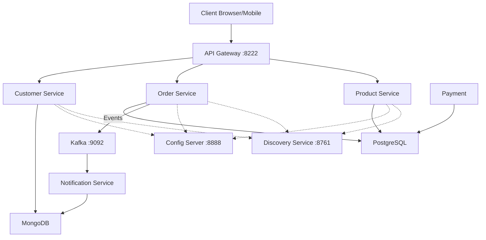

# Microservices Architecture Overview

This document describes the high-level architecture of the system, the core components that orchestrate the services, and the deployment/containerization strategy.

## 1. The Core Infrastructure (The "Hooks")

The system relies on three primary components to "hook" everything together:

### A. Config Server (Spring Cloud Config)
- **Role**: Centralized configuration management.
- **How it works**: All microservices (Product, Order, etc.) fetch their configuration (YAML/Properties) from this server at startup. This allows for dynamic configuration changes without recompiling the code.
- **Port**: `8888`

### B. Discovery Service (Netflix Eureka)
- **Role**: Service Registry and Discovery.
- **How it works**: Every microservice instances registers itself with Eureka on startup. When Service A needs to call Service B, it asks Eureka for the location (IP/Port) of Service B. This eliminates hard-coded URLs.
- **Port**: `8761`

### C. API Gateway (Spring Cloud Gateway)
- **Role**: The entry point for all external requests.
- **How it works**: Routes incoming requests to the appropriate microservice based on the URL path. It also handles concerns like security, rate limiting, and cross-cutting logging.
- **Port**: `8222`

## 2. Service Interaction & Messaging

- **Kafka**: Used for asynchronous, event-driven communication. For example, when an Order is placed, the `order-service` emits a message to Kafka, which the `notification-service` consumes to send exit emails.
- **Zipkin**: Provides distributed tracing, allowing developers to track a request as it hops through multiple microservices to find performance bottlenecks.

## 3. Containerization and Deployment

### How images are created
The project uses **Cloud Native Buildpacks (CNB)** via the Spring Boot Maven Plugin. 
- **Method**: Instead of writing manual `Dockerfiles`, we use the command:
  ```bash
  mvn spring-boot:build-image
  ```
- **Where are they stored?**: 
    - Unlike compilation artifacts (like `.jar` files in the `target` folder), Docker images are **not stored as files in your project directory**.
    - They are managed directly by the **Docker Daemon** (or Docker Desktop engine).
    - When you run the build command, the plugin communicates with your local Docker socket to create and store the image layers in Docker's internal, binary storage (typically inside a virtual disk managed by Docker Desktop on Windows).
- **How to find them?**: 
    - You can view the created images by running `docker images` in your terminal.
    - You will see images named after your service name (e.g., `docker.io/library/product:0.0.1-SNAPSHOT`).
- **Benefits**: Automatically produces OCI-compliant, optimized Docker images using best practices for Java runtimes (JRE layering, security patches).

### Deployment Strategy
1.  **Infrastructure Lifecycle**: Supporting services (Databases, Kafka, Zipkin) are managed via `docker-compose.yml`.
2.  **Container Runtime**: Once built, the microservice images can be run as standard Docker containers:
    ```bash
    docker run -p 8080:8080 my-microservice-image
    ```
3.  **Scalability**: The design is "Cloud Native," making it ready for deployment into **Kubernetes (K8s)** clusters or cloud platforms like AWS/GCP.

## 4. Logical Components Diagram



---

## 5. Development Infrastructure: MailDev

To facilitate testing of the asynchronous notification flow without actually sending emails to real users, the project uses **MailDev**.

### What is MailDev?
MailDev is an open-source tool that provides a dummy SMTP server and a web-based mail client. It "catches" all emails sent by the application and displays them in a browser, rather than delivering them to the actual internet.

### Technical Implementation & "Develop" Flow
The email feature is developed using a multi-layered approach:

1.  **Backend (Java/Spring Boot)**:
    - **Service**: The `EmailService.java` manages the logic.
    - **Dependencies**: Leverages `spring-boot-starter-mail` (for SMTP communication) and `spring-boot-starter-thymeleaf` (for HTML templating).
    - **Templating**: **Thymeleaf**, which allows for dynamic, data-driven HTML content.
    - **Trigger**: Kafka consumers asynchronously invoke the service upon receiving Order/Payment events.

2.  **Infrastructure (Docker)**:
    - Defined in `docker-compose.yml` under the `mail-dev` service.
    - **Port 1025**: The SMTP port where the application sends mail.
    - **Port 1080**: The Web UI port where you view the caught emails.

3.  **Service Configuration (`notification-service`)**:
    The service is configured in `notification-service.yml` to redirect traffic to the containerized SMTP relay:
    ```yaml
    spring:
      mail:
        host: localhost
        port: 1025
        username: alibou
        password: alibou
    ```

### Developer Workflow
- **Code**: Write Java logic and HTML templates in the `notification-service`.
- **Test**: Run the microservices stack and trigger an action (like a test purchase).
- **Inspect**: Open [http://localhost:1080](http://localhost:1080) to verify the layout, content, and variables of the resulting email without cluttering a real inbox.

---
*Generated by Antigravity*
