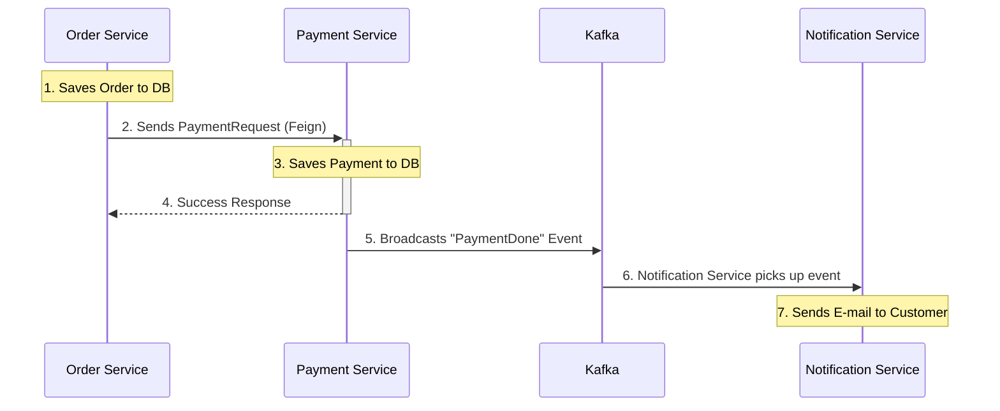

# Backend Technical Mechanics & Design Decisions

This document provides a deep dive into the technical implementation of our microservices. It explains the "how" and "why" behind the code, serving as an intuitive reference for developers.

---

## 1. Inter-Service Communication: The "Invoice" Pattern

In our system, services don't just "talk"; they exchange formal contracts. The most critical example is the interaction between the **Order Service** and the **Payment Service**.

### 💼 What is `PaymentRequest`?
Think of `PaymentRequest` as a **standardized Digital Invoice**. 

*   **The Orchestrator**: The `OrderService` knows how to sell products, but it doesn't know how to handle money.
*   **The Request**: When an order is saved, the `OrderService` creates this "Invoice" (`PaymentRequest`) containing:
    - How much to charge (`amount`)
    - Who to charge (`customer`)
    - Which order it belongs to (`orderReference`)
*   **The Handover**: It hands this invoice to the **Payment Service** via a **Feign Client**.

### 🌉 The Feign Client: Our Communication Bridge
We use **OpenFeign** (`PaymentClient.java`) to make this call intuitive:
- **Declarative**: We only define an interface. Spring generates the "plumbing" to send the HTTP request.
- **Service Discovery**: It uses **Eureka** to find the Payment Service automatically, so we don't have to hard-code IP addresses.

---

## 2. The Payment Service Lifecycle
Once the Payment Service receives the `PaymentRequest`, it starts a two-step "Mission":

### Step A: Recording (PostgreSQL)
It saves the transaction details to its own database. This creates a dedicated **Financial Audit Trail**. Even if the Order Service is deleted, the Payment records remain safe and searchable for accounting.

### Step B: The "Megaphone" (Kafka Notification)
The Payment Service doesn't send emails. Instead, it uses a **Kafka Producer** to broadcast a message to the `payment-topic`. 
> *"I've successfully processed payment for Order AUTO_ORD_1234!"*

**Why Kafka?**
- **Asynchronous**: The Payment Service doesn't wait for the email to be sent. It broadcasts the news and immediately goes back to work.
- **Decoupled**: The Payment Service doesn't even know the **Notification Service** exists! It just "shouts" into the Kafka megaphone.

---

## 📡 3. The Big Picture: Visual Flow

---

## ⚠️ 4. Current Risks & Evolution

### The "Synchronous Block" Problem
Currently, Step 2 (Order -> Payment) is **Synchronous**. 
- **The Risk**: If the Payment Service is down, the Order Service "freezes" and the customer gets an error, even if the order was already saved.
- **The Solution (Phase 1)**: We are implementing a **Circuit Breaker**. If the Payment Service is slow/down, the "Circuit" will open, failing the request instantly with a friendly message instead of a long timeout.

---
*Maintained by the Antigravity Engineering Team*
